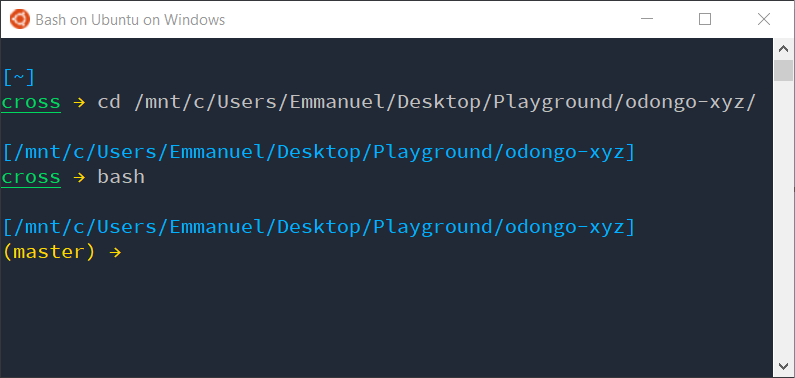
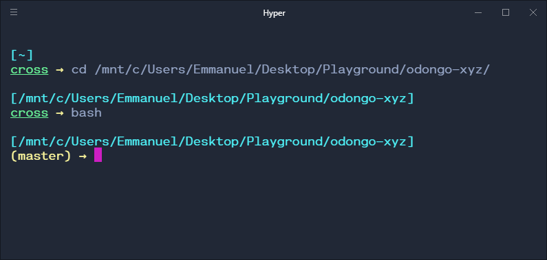
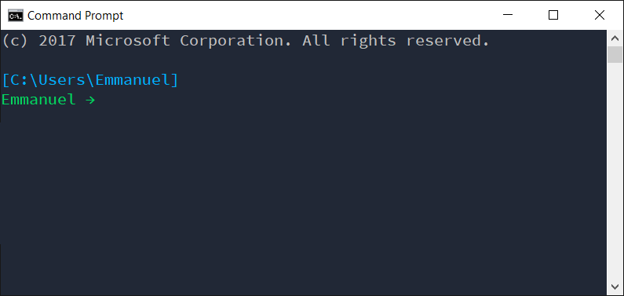

# Prompt Statements
My custom prompt statements for various terminals:
1. [Bash](#bash)
2. [CMD](#cmd)
3. [PowerShell](#powershell)

## Bash*

Bash on Ubuntu on Windows



[Hyper](https://hyper.is/) – with the [`hyper-electron-higlighter`](https://www.npmjs.com/package/hyper-electron-highlighter) plugin enabled



Paste the following at the bottom of .bashrc

```bash
parse_git_branch() {
  git symbolic-ref --short HEAD 2> /dev/null
}
current_branch="$(parse_git_branch)"
if [[ -z "$current_branch" ]]; then
  PS1="\n\[\033[38;5;39m\][\w]\[\033[0m\]\[\033[1;38;5;41m\]\n\[\033[1;4;38;5;41m\]\u\[\033[0;38;5;220m\] → \[\033[0m\]"
else
  PS1="\n\[\033[38;5;39m\][\w]\[\033[0m\]\n\[\033[38;5;220m\]($current_branch) → \[\033[0m\]"
fi
```

\* *This has been tested only on the Windows Subsystem for Linux with [Git for Windows](https://git-for-windows.github.io/) installed*

---

## CMD



Set the PROMPT environment variable.  
`setx PROMPT "$E[38;5;39m[$P]$_$E[38;5;41mEmmanuel → $E[0m"`

---

## PowerShell


Create a PowerShell profile if none exists already by running.  
`new-item -itemtype file -path $profile -force`

Open the profile using notepad.  
`notepad $PROFILE`

Paste the block of code below:

```powershell
      # https://stackoverflow.com/a/44411205/6454553
      function Write-GitBranchName {
        try {
          $branch = git rev-parse --abbrev-ref HEAD

          if ($branch -eq "HEAD") {
            # detached HEAD, print SHA
            $sha = git rev-parse --short HEAD
            Write-Host "($sha)" -n -f Red
          }
          elseif ($branch -eq "master") {
            Write-Host "($branch)" -n -f Yellow
          }
          else {
            Write-Host "($branch)" -n -f DarkGreen
          }
        } catch {
          # newly initiated git repo
          Write-Host "(no branches yet)" -n -f DarkGreen
        }
      }


      function Write-Directory {
        $directory = "[$($ExecutionContext.SessionState.Path.CurrentLocation)]"
        Write-Host $directory -f DarkCyan
      }


      function Write-UserName {
        Write-Host "$env:username" -n -f DarkGreen
      }


      function Write-Arrow {
        $arrow = " $("$([char]0x2192)" * ($nestedPromptLevel + 1))"
        Write-Host $arrow -n -f DarkGreen
      }


      function Prompt {
        Write-Directory

        if (Test-Path .git) {
          Write-GitBranchName
        }
        else {
          Write-UserName
        }

        Write-Arrow
        return " "
      }

```

### Useful snippets

- Print all the available colours – [source](https://blogs.technet.microsoft.com/gary/2013/11/20/sample-all-powershell-console-colors/)  
`[enum]::GetValues([System.ConsoleColor]) | Foreach-Object {Write-Host $_ -ForegroundColor $_}`
